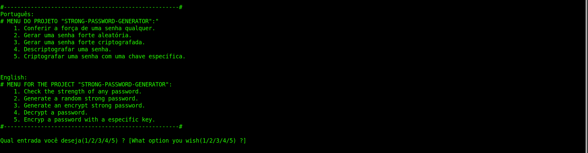
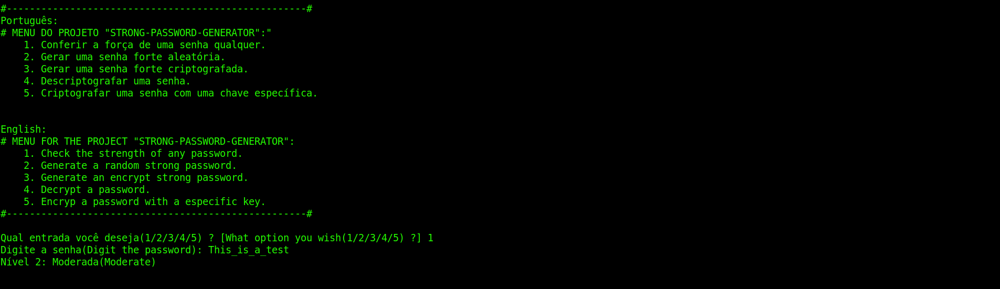
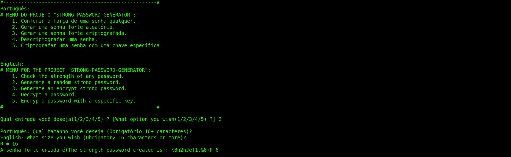
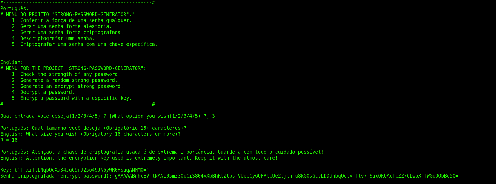
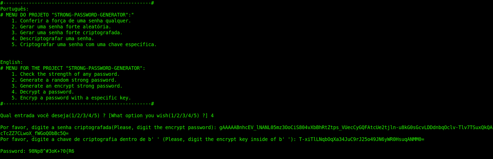
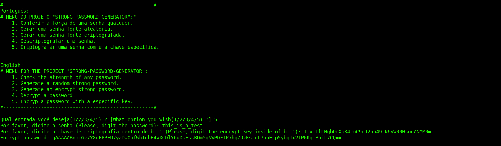

# Strong-Password-Generator
## Desenvolvido nas férias  de verão do ano de 2024/2025 (Developed during the summer vacation of 2024/2025)
## Antonio da Ressurreição Filho, student in the third semester of Computer Science at the Federal University of Paraná (UFPR).

# Português:

O trabalho foi desenvolvido nas férias do ano de 2024/2025. Eu fiz ele com o intuito de me aperfeiçoar na área de Cybersegurança, utilizando bibliotecas na linguagem
Python como **secrets** e **cryptography**. Ademais, ele consiste basicamente em um projeto que envolve senhas e criptografia de modo a deixar a conta dos usuários que
o utilizam cada vez mais segura.

***Arquivo "Comments.txt":***

Esse arquivo consiste na tradução para a língua inglesa dos comentários contidos no meu programa principal: **"Generator.py"**, os quais eu achei que deixariam o programa
confuso se fossem colocados juntos com os comentários dentro do projeto que estão na língua portuguesa.

***Menu.txt:***

Nesse arquivo de extensão .txt está o Menu que é utilizado quando o usuário executa o programa, o qual especifica as instruções iniciais e como o usuário deve prosseguir a
partir do momento que executa o projeto.

***Generator.py:***

Nesse arquivo está contido o código principal do programa, o qual se começa definindo as bibliotecas usadas no projeto, seguidas das funções secundárias que são utlizadas no
projeto e depois a função principal que tem os prints principais e a chamada dessas funções secundárias anteriormente definidas.

## Imagens do visual que aparece para o usuário quando ele executa o programa:

- Menu do meu projeto(o qual aparece a partir do momento que o usuário executa o programa):

- Opção 1:

- Opção 2:

- Opção 3:

- Opção 4:

- Opção 5:

## English:

The work was developed during the summer vacation of 2024/2025. I created it with the intention of improving my skills in the field of Cybersecurity, using libraries in the Python 
language such as **secrets** and **cryptography**. Furthermore, it basically consists of a project involving passwords and encryption to make the user accounts that utilize 
it increasingly secure.

***File "Comments.txt":***

This file contains the English translation of the comments in my main program: **"Generator.py"**, which I thought would make the program confusing if they were placed alongside 
the comments in Portuguese within the project.

***Menu.txt:***

This .txt file contains the menu used when the user executes the program, which specifies the initial instructions and how the user should proceed from the moment the project 
is executed.

***Generator.py:***

This file contains the main code of the program, which starts by defining the libraries used in the project, followed by the secondary functions utilized in the project, and 
then the main function, which includes the primary prints and the calls to these previously defined secondary functions.

## Images of the interface displayed to the user when they run the program:

- Menu of my project (which appears as soon as the user executes the program):

- Option 1:

- Option 2:

- Option 3:

- Option 4:

- Option 5:

